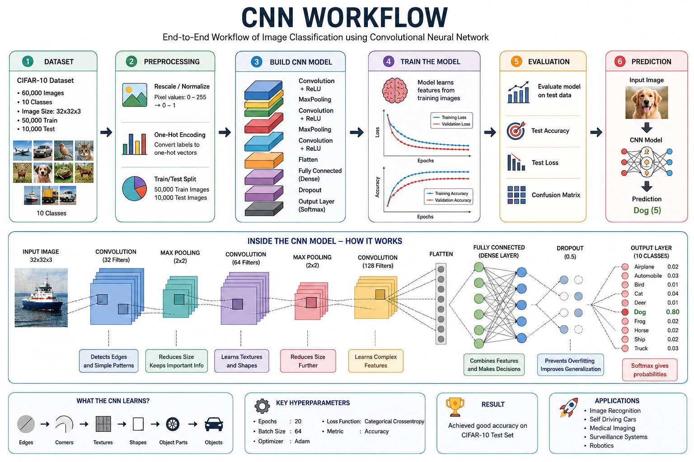

# ML_CIFAR10

# 🧠 Image Classification using Convolutional Neural Networks (CNN) on CIFAR-10

<p align="center">
  
  
  
  
</p>

---

# 📌 Project Overview

This project demonstrates how **Deep Learning** can be used to automatically recognize and classify images. A **Convolutional Neural Network (CNN)** is built using **TensorFlow** and **Keras** to classify images from the **CIFAR-10** dataset into one of ten different object categories.

Instead of manually writing rules to identify objects, the CNN learns important visual features directly from thousands of labeled images. During training, the model gradually learns to recognize patterns such as edges, textures, shapes, and complete objects, enabling it to predict the correct class for unseen images.

This project introduces the complete workflow of an image classification system, from data preprocessing to model training, evaluation, and visualization of results.

---

# 🎯 Motto of the Project

The primary goal of this project is:

> **To build an intelligent image classification system that learns from examples and automatically recognizes objects in images using Convolutional Neural Networks (CNNs).**

Humans can easily recognize objects like cars, airplanes, cats, and dogs because our brains have learned these patterns over time. Similarly, this project teaches a computer to recognize objects by training it with thousands of labeled images.

Rather than programming explicit rules such as:

* If the image has wings, then it is an airplane.
* If the image has four wheels, then it is a car.

the CNN automatically learns these visual characteristics through training.

This is one of the fundamental ideas behind Artificial Intelligence and Deep Learning.

---

# ❓ Why This Project?

Image classification is one of the most important problems in Computer Vision.

Many modern technologies rely on image classification, including:

* Face Recognition
* Self-Driving Cars
* Medical Image Analysis
* Traffic Sign Detection
* Wildlife Monitoring
* Smart Surveillance Systems
* Product Recognition
* Optical Character Recognition (OCR)

This project provides a strong foundation for understanding how these systems work.

---

# 📚 About the CIFAR-10 Dataset

The model is trained using the **CIFAR-10** dataset.

Dataset Details:

* Total Images: **60,000**
* Training Images: **50,000**
* Testing Images: **10,000**
* Image Size: **32 × 32 Pixels**
* Color Channels: **RGB (3 Channels)**

Each image belongs to one of the following ten classes:

| Class      | Label |
| ---------- | ----- |
| Airplane   | 0     |
| Automobile | 1     |
| Bird       | 2     |
| Cat        | 3     |
| Deer       | 4     |
| Dog        | 5     |
| Frog       | 6     |
| Horse      | 7     |
| Ship       | 8     |
| Truck      | 9     |

---

# 🛠 Technologies Used

* Python
* TensorFlow
* Keras
* NumPy
* Matplotlib
* Google Colab

---

# 🧠 Understanding CNN

A **Convolutional Neural Network (CNN)** is a specialized deep learning model designed for image processing tasks.

Instead of looking at an entire image at once, a CNN scans small regions of the image using filters to learn meaningful visual features.

The learning process generally follows these stages:

1. Detect edges
2. Detect corners
3. Detect textures
4. Detect shapes
5. Detect object parts
6. Recognize complete objects

Because of this hierarchical learning process, CNNs perform exceptionally well in image classification tasks.

---

# 🔄 Project Workflow

```text
Load CIFAR-10 Dataset
          │
          ▼
Normalize Pixel Values
          │
          ▼
One-Hot Encode Labels
          │
          ▼
Build CNN Model
          │
          ▼
Compile Model
          │
          ▼
Train the Network
          │
          ▼
Evaluate Model
          │
          ▼
Visualize Accuracy & Loss
          │
          ▼
Predict Image Class
```

---

## 🧠 CNN Workflow Illustration

<p align="center">
  
</p>

# ⚙️ Data Preprocessing

## 1. Loading the Dataset

The CIFAR-10 dataset is loaded directly from TensorFlow.

The dataset automatically provides:

* Training Images
* Training Labels
* Testing Images
* Testing Labels

---

## 2. Image Normalization

Original pixel values range from:

0 → 255

These values are converted into:

0 → 1

by dividing each pixel value by 255.

Normalization helps the neural network learn faster and improves training stability.

---

## 3. One-Hot Encoding

Original labels are integers such as:

```
Dog → 5
Cat → 3
Truck → 9
```

These labels are converted into vectors because the output layer predicts probabilities for all ten classes.

Example:

```
Dog

↓

[0 0 0 0 0 1 0 0 0 0]
```

---

# 🏗 CNN Architecture

The model consists of the following layers:

```
Input Layer
      │
      ▼
Conv2D (32 Filters)
      │
      ▼
MaxPooling
      │
      ▼
Conv2D (64 Filters)
      │
      ▼
MaxPooling
      │
      ▼
Conv2D (128 Filters)
      │
      ▼
Flatten
      │
      ▼
Dense (128 Neurons)
      │
      ▼
Dropout (0.5)
      │
      ▼
Output Layer (10 Classes)
```

---

# 📖 Layer Explanation

### Convolution Layer

Extracts important image features such as edges, textures, and patterns.

### Max Pooling Layer

Reduces image size while preserving important information.

This decreases computational complexity.

### Flatten Layer

Converts the feature maps into a one-dimensional vector that can be processed by fully connected layers.

### Dense Layer

Learns relationships between extracted features.

Acts as the decision-making part of the network.

### Dropout Layer

Randomly disables neurons during training.

This reduces overfitting and improves model generalization.

### Output Layer

Uses the Softmax activation function to predict probabilities for each of the ten classes.

---

# ⚙️ Model Compilation

Optimizer:

```
Adam
```

Loss Function:

```
Categorical Crossentropy
```

Evaluation Metric:

```
Accuracy
```

---

# 🚀 Model Training

The model is trained using:

* Epochs: **20**
* Batch Size: **64**

During each epoch the model performs:

1. Forward Propagation
2. Prediction
3. Loss Calculation
4. Backpropagation
5. Weight Update

This process repeats until the model learns meaningful image features.

---

# 📊 Model Evaluation

After training, the model is tested using unseen images.

The evaluation measures:

* Test Accuracy
* Test Loss

A higher accuracy indicates better classification performance.

Typical performance for this architecture is:

| Metric            | Expected Value |
| ----------------- | -------------- |
| Training Accuracy | 85–95%         |
| Testing Accuracy  | 75–85%         |

Actual values may vary depending on random initialization and training conditions.

---

# 📈 Training Graphs

The project visualizes:

* Training Accuracy
* Validation Accuracy
* Training Loss
* Validation Loss

These graphs help monitor the learning process and identify overfitting or underfitting.

---

# 💡 Applications

The concepts learned in this project are used in:

* Face Recognition Systems
* Medical Diagnosis
* Autonomous Vehicles
* Industrial Quality Inspection
* Smart Traffic Systems
* Robotics
* Security Surveillance
* Wildlife Detection


# 🔮 Future Improvements

Some enhancements that can further improve model performance include:

* Data Augmentation
* Batch Normalization
* Early Stopping
* Model Checkpointing
* Learning Rate Scheduling
* Transfer Learning using VGG16, ResNet50, or EfficientNet
* Hyperparameter Tuning

---

# 🎓 Learning Outcomes

After completing this project, you will understand:

* Fundamentals of Deep Learning
* Image Preprocessing
* Convolutional Neural Networks
* Feature Extraction
* Model Training
* Model Evaluation
* Image Classification
* Visualization of Learning Curves

---

# 👨‍💻 Author

**Sai Rohith**

Aspiring AI & Machine Learning Engineer

Interested in Artificial Intelligence, Deep Learning, Computer Vision, Data Science, and Full-Stack Development.


